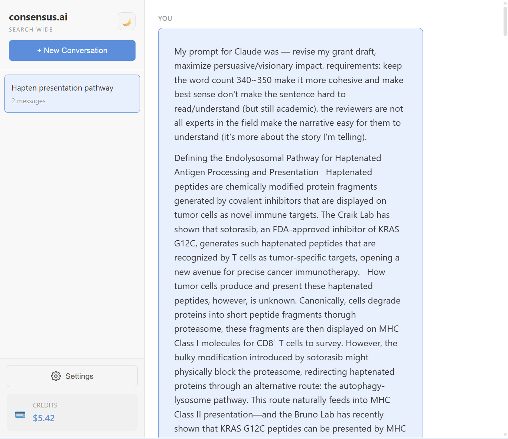
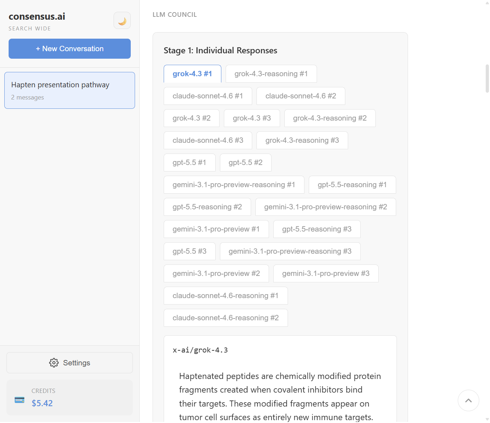
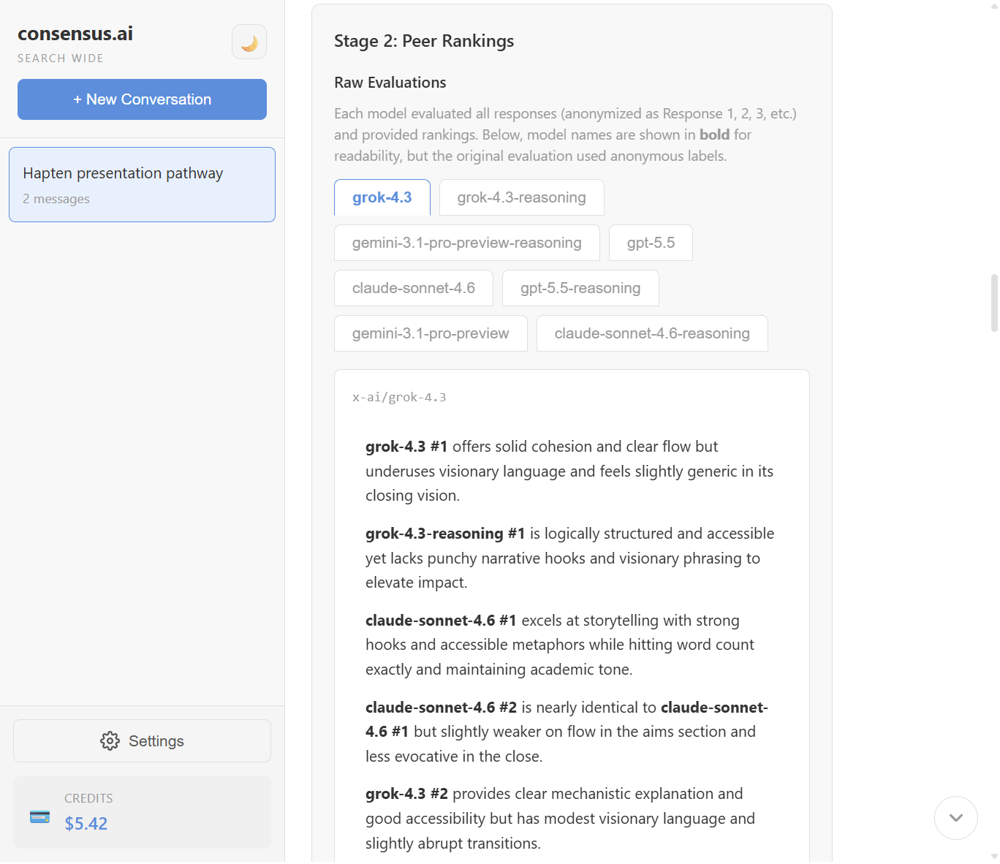
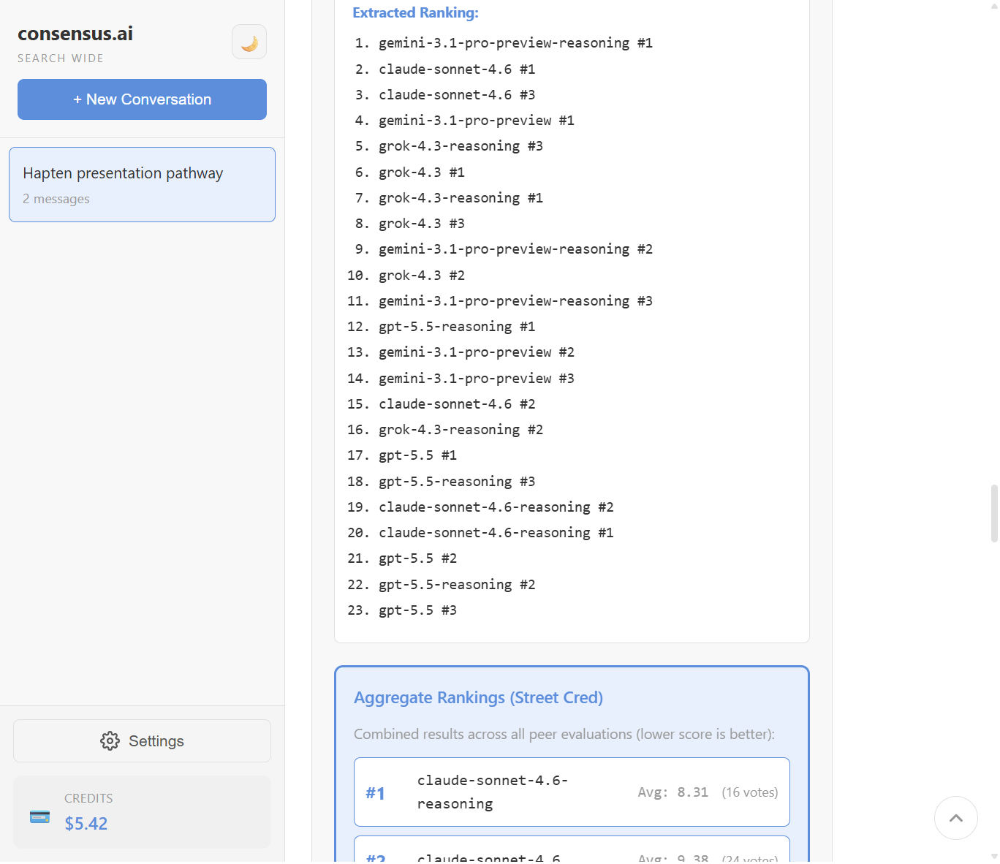
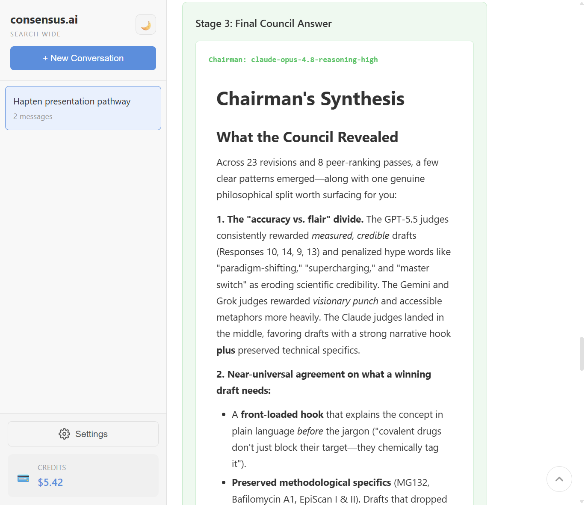
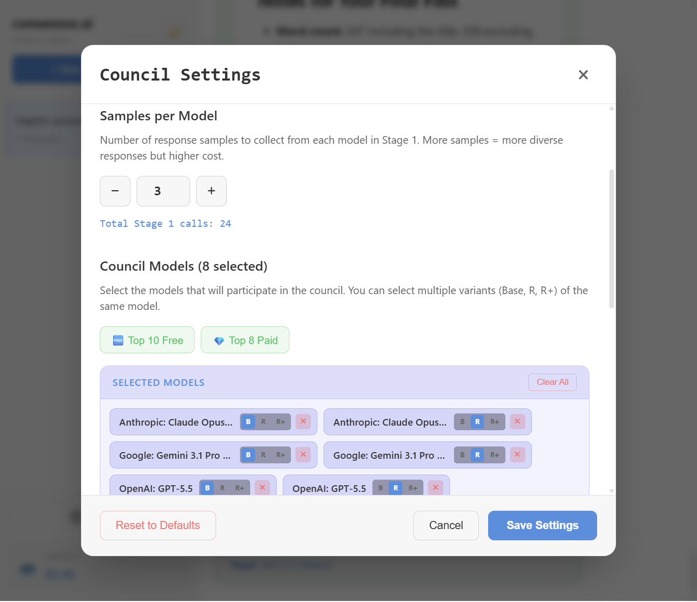
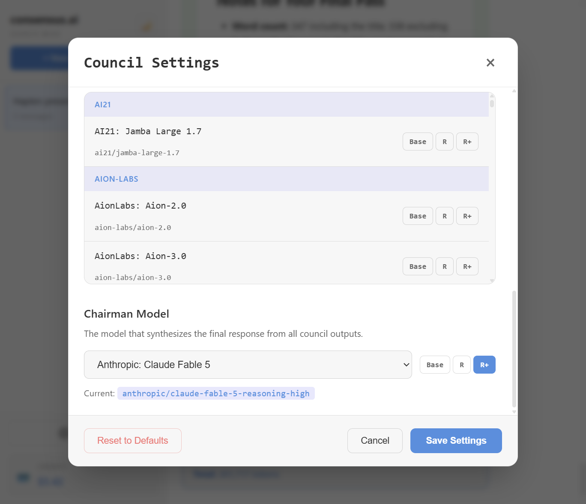
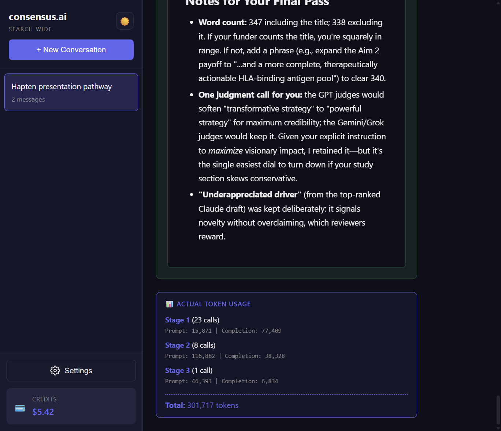

# consensus.ai

**Search Wide** — a local web app where multiple LLMs answer your question, anonymously rank each other's work, and a Chairman model synthesizes the final response.

Fork of [karpathy/llm-council](https://github.com/karpathy/llm-council) with a settings UI, streaming progress, reasoning modes, cost estimates, and OpenRouter credits in the sidebar.

## How it works

1. **Stage 1: First opinions** — Your query goes to every council model in parallel. With `N_SAMPLES > 1`, each model can produce multiple independent answers. Responses appear in a tab view.
2. **Stage 2: Peer review** — Each model evaluates anonymized responses (`Response A`, `Response B`, …) and ranks them. The UI shows raw evaluations, parsed rankings, and aggregate scores.
3. **Stage 3: Final answer** — The Chairman reads all responses and rankings, then produces a synthesized answer.

## Screenshots

### 1. Ask a question


### 2. Stage 1 — individual model responses


### 3. Stage 2 — raw peer evaluations


### 4. Stage 2 — extracted and aggregate rankings


### 5. Stage 3 — final council answer


### 6. Settings — council models


### 7. Settings — chairman model


### 8. Token usage breakdown


## Features

- **Settings UI** — Pick council models, chairman, samples per model, and API key without editing code
- **Reasoning modes** — Each model supports **Base**, **R** (medium reasoning), and **R+** (high reasoning) via `-reasoning` / `-reasoning-high` suffixes
- **Quick presets** — Top 10 Free and Top 8 Paid model shortcuts in Settings
- **Streaming** — Live progress during Stage 1–3; resume interrupted runs from where they stopped
- **Cost estimate** — Estimated OpenRouter cost shown before you send (based on council + chairman pricing)
- **Credits display** — OpenRouter balance in the sidebar
- **Attachments** — Paste or attach images and small text files with your prompt
- **Dark mode** — Toggle in the sidebar

## Setup

### 1. Install dependencies

**Backend** (Python 3.10+):

```bash
# Option A: uv
uv sync

# Option B: local venv
python -m venv .venv
.\.venv\Scripts\python.exe -m pip install "fastapi>=0.115.0" "uvicorn[standard]>=0.32.0" "python-dotenv>=1.0.0" "httpx>=0.27.0" "pydantic>=2.9.0"
```

**Frontend:**

```bash
cd frontend
npm install
cd ..
```

### 2. Configure API key

Create a `.env` file in the project root:

```bash
OPENROUTER_API_KEY=sk-or-v1-...
```

Get your key at [openrouter.ai](https://openrouter.ai/). You can also set or update the key in **Settings** at runtime (stored in memory until the backend restarts).

### 3. Configure models (optional)

Defaults live in `backend/config.py`. You can also change everything in the Settings UI without restarting.

```python
COUNCIL_MODELS = [
    "openai/gpt-5.5",
    "google/gemini-3.1-pro-preview",
    "anthropic/claude-opus-4.8",
    "x-ai/grok-4.5",
    "openai/gpt-5.5-reasoning",
    "google/gemini-3.1-pro-preview-reasoning",
    "anthropic/claude-opus-4.8-reasoning",
    "x-ai/grok-4.5-reasoning",
]

N_SAMPLES = 3

CHAIRMAN_MODEL = "anthropic/claude-fable-5-reasoning-high"
```

## Running the application

**Terminal 1 — backend** (port **8001**, run from project root):

```bash
# uv
uv run python -m backend.main

# or local venv
.\.venv\Scripts\python.exe -m backend.main
```

**Terminal 2 — frontend** (port **5173**):

```bash
cd frontend
npm run dev
```

Open **http://localhost:5173** in your browser.

On Linux/macOS you can also use `./start.sh` (requires `uv` and `npm` on PATH).

## Tech stack

- **Backend:** FastAPI, async httpx, OpenRouter API (port 8001)
- **Frontend:** React + Vite, react-markdown + GFM tables
- **Storage:** JSON files in `data/conversations/`
- **Package management:** uv or pip + `.venv` for Python, npm for JavaScript

## Credits

Based on [LLM Council](https://github.com/karpathy/llm-council) by Andrej Karpathy.
